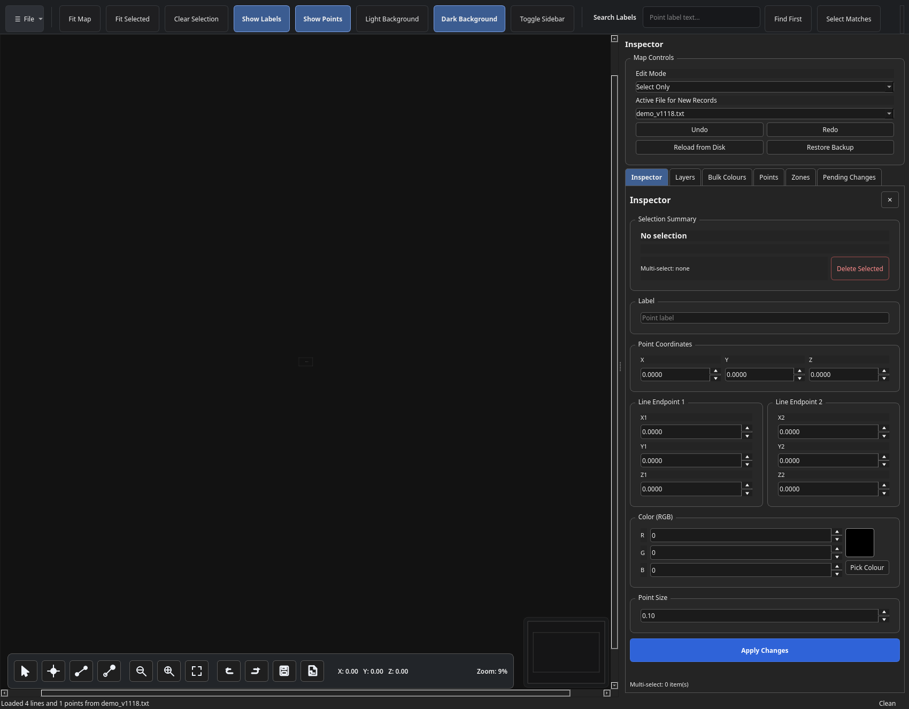
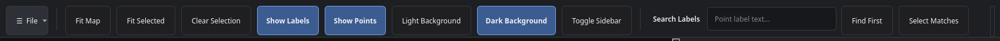
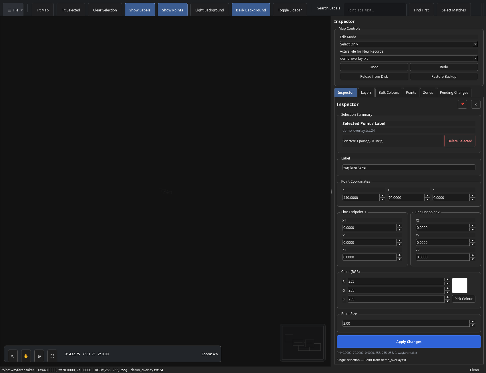
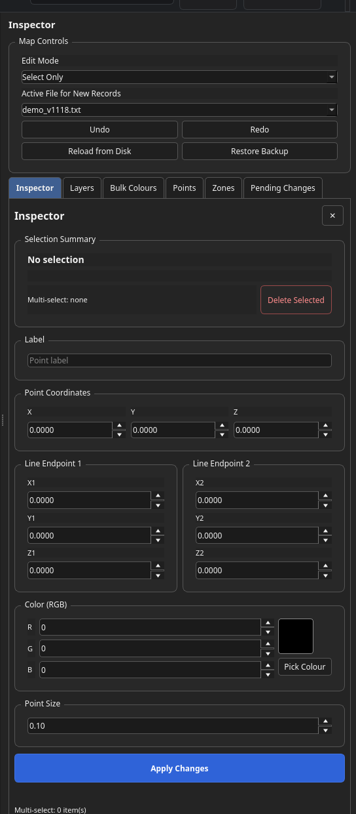
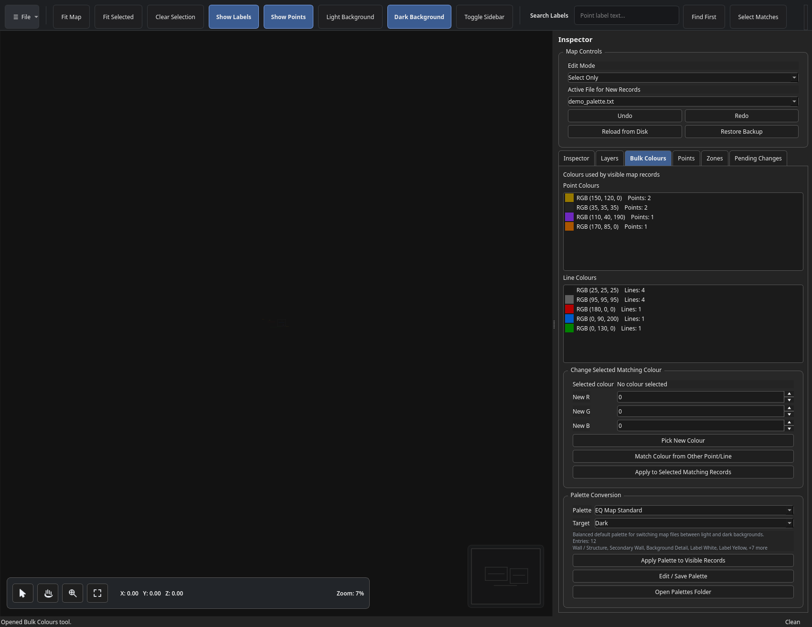
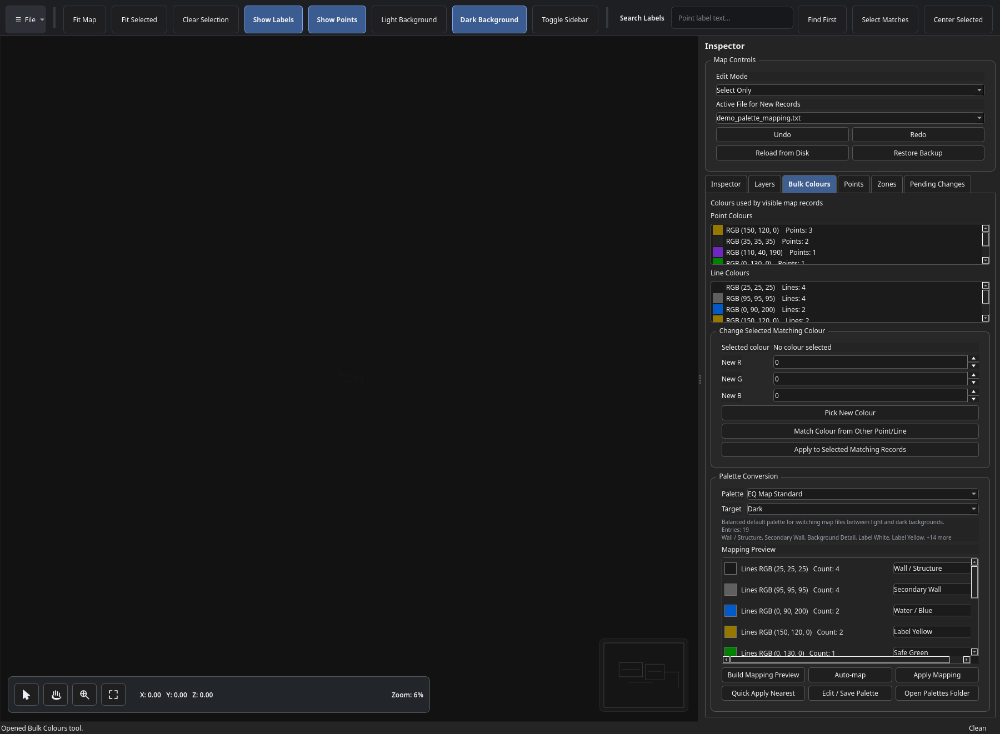

# EQ Map Editor

EQ Map Editor is a desktop editor for EverQuest map `.txt` files. It can load one or more map files for a zone, render the lines and points, edit labels and colours, move points and line segments, bulk-edit map colours, and save the changes back to the original map text files with backups.

This README is written for **v1.1.19 Beta**.



## What this program edits

EverQuest map files are plain text files. The editor focuses on the two common record types:

```text
L x1, y1, z1, x2, y2, z2, r, g, b
P x, y, z, r, g, b, size, label
```

`L` records are map lines. `P` records are map points and labels. The editor preserves unedited lines where possible and writes changed records back to the map file when you save.

## Recommended beta workflow

Before editing your real map pack, copy the folder and work from the copy.

```text
1. Copy your EverQuest maps folder.
2. Open the copied folder or copied map files in EQ Map Editor.
3. Make edits.
4. Use Save As... first if testing.
5. Use Save Edits only when you are ready to modify the source files.
```

The app creates backups in the local `app/backups/` folder before overwriting source files, but keeping a separate copy of your map pack is still the safest workflow.

## Installation and running from source

Extract the package to a folder, for example:

```powershell
C:\git-anotheregostar\eqmapeditor\eq_map_editor_v1_1_19
```

From PowerShell:

```powershell
cd "C:\git-anotheregostar\eqmapeditor\eq_map_editor_v1_1_19"
python -m pip install -r requirements.txt
python .\app\eq_map_editor.py
```

To open a map folder directly:

```powershell
python .\app\eq_map_editor.py "C:\EverQuest\maps"
```

To open one file directly:

```powershell
python .\app\eq_map_editor.py "C:\EverQuest\maps\poknowledge_1.txt"
```

When running from Python source, Windows may show the Python icon in the taskbar. The custom icon is most reliable in the built `.exe`.

## Building the Windows EXE

Run the included build script:

```powershell
.\build_windows.bat
```

The standalone build is created under:

```text
dist\EQMapEditor\EQMapEditor.exe
```

The PyInstaller spec embeds the app icon from:

```text
app\resources\eq_maps_icon.ico
```

If Windows still shows an old generic icon after rebuilding, create a new shortcut or restart Windows Explorer to clear the icon cache.

## Main interface overview

The main window has five areas:

1. **Top toolbar** for file access, view toggles, search, and sidebar controls.
2. **Map canvas** for viewing and editing the loaded map files.
3. **Bottom canvas toolbar** for edit modes, zoom, undo/redo, save, revert, and live coordinates.
4. **Mini-map overview** showing the full map and the current viewport rectangle.
5. **Right sidebar** with Inspector, Layers, Bulk Colours, Points, Zones, and Pending Changes tabs.

## Top toolbar



The top toolbar contains the most common navigation and view actions.

| Control | What it does |
|---|---|
| **File** | Opens the file menu with open/save/revert/backup/preferences/help actions. |
| **Fit Map** | Fits all visible map records into the canvas. |
| **Fit Selected** | Centers and zooms to selected records. |
| **Clear Selection** | Clears selected map items. |
| **Show Labels** | Toggles point labels on/off. |
| **Show Points** | Toggles point markers on/off. |
| **Light Background** | Switches the map canvas to a light background. |
| **Dark Background** | Switches the map canvas to a dark background. |
| **Toggle Sidebar** | Hides or shows the right tool sidebar. |
| **Search Labels** | Searches labels by text. |
| **Find First** | Finds the first matching label. |
| **Select Matches** | Selects all labels matching the search text. |
| **Center Selected** | Centers the map view on the current selection. |

## File menu

The File menu contains longer-running or less frequently used actions.

| Menu item | What it does |
|---|---|
| **Open Map File(s)** | Opens one or more `.txt` map files. |
| **Save Edits** | Saves dirty records back to their source files. |
| **Save As...** | Saves the current map data to a new location. |
| **Revert Unsaved** | Reloads the current files from disk and discards unsaved edits. |
| **Restore Backup...** | Restores a selected backup file. |
| **Open Backup Folder** | Opens `app/backups/`. |
| **Preferences** | Opens app preferences. |
| **Controls** | Shows basic control help. |
| **Keyboard Shortcuts** | Shows keyboard shortcuts. |
| **Quick Start** | Shows a quick-start workflow reminder. |
| **Open Logs Folder** | Opens `app/logs/`. |
| **About** | Shows version and local folder paths. |
| **Exit** | Closes the program after checking for unsaved edits. |

## Bottom canvas toolbar


The bottom overlay is the fastest way to change edit mode and perform common edit actions while staying focused on the map.

| Icon / control | What it does |
|---|---|
| **Select Only** | Selects and inspects records without moving them. |
| **Move Points** | Lets selected point records be dragged. |
| **Move Lines** | Lets selected line segments be dragged as a whole. |
| **Move Line Endpoints** | Shows endpoint handles for selected lines and lets you move one endpoint. |
| **Zoom Out** | Zooms the map canvas out. |
| **Zoom In** | Zooms the map canvas in. |
| **Fit Map** | Fits the full visible map to the canvas. |
| **Undo** | Reverses the last supported edit. |
| **Redo** | Re-applies the last undone edit. |
| **Save Edits** | Saves changed records to their source map files. |
| **Revert Unsaved** | Reloads from disk and discards unsaved changes. |
| **X / Y / Z readout** | Shows the current map coordinate under the cursor. |
| **Zoom readout** | Shows current zoom level. |

Right-click or middle-click drag still pans the map. Mouse wheel zooms in and out.

## Mini-map overview

The mini-map in the lower-right corner shows the full loaded map and a rectangle representing the current viewport.



This is especially useful when zoomed in on large zones. The map canvas also has extra pan padding, so you can pan past the edges and center edge content in the view.

## Inspector tab



The Inspector edits the currently selected point or line. It also controls edit mode and active file for newly created records.

### Map Controls

| Control | What it does |
|---|---|
| **Edit Mode** | Select Only, Move Points, Move Lines, or Move Line Endpoints. |
| **Active File for New Records** | Chooses which loaded map file receives newly added points/lines. |
| **Undo / Redo** | Same as toolbar undo/redo. |
| **Reload from Disk** | Discards unsaved changes and reloads files. |
| **Restore Backup** | Restores a backup over a source file. |

### Selection Summary

The summary shows whether you have no selection, one record selected, or multiple records selected. For multi-select, coordinate fields are disabled, but colour editing remains available.

### Point fields

For point records, you can edit:

```text
Label
X / Y / Z
RGB colour
Point size
```

### Line fields

For line records, you can edit:

```text
Endpoint 1: X1 / Y1 / Z1
Endpoint 2: X2 / Y2 / Z2
RGB colour
```

### Applying changes

After changing fields, click **Apply Changes**. Edits become dirty until saved.

## Selecting records

Supported selection behaviour:

```text
Click a point or line to select it.
Ctrl-click to add or remove individual records from selection.
Left-drag a selection rectangle to select multiple visible records.
Esc clears the selection.
Delete removes selected records after confirmation.
```

Selected records are highlighted with a glow/pulse-style highlight instead of a large selection box.

## Adding records

Double-left-click on the map canvas to add records. The active file is chosen in the Inspector’s **Active File for New Records** dropdown.

For points, the popup asks for:

```text
Label
Colour
Point size
```

For lines, the workflow asks for the second endpoint and colour details.

New records can be undone.

## Moving records

Use the bottom toolbar or Inspector **Edit Mode** dropdown.

| Mode | Behaviour |
|---|---|
| **Select Only** | Safe inspection mode. Nothing moves. |
| **Move Points** | Drag selected point records. |
| **Move Lines** | Drag selected line records as whole segments. |
| **Move Line Endpoints** | Select a line, then drag endpoint handles. |

Moved records are written back to their original map file when saved.

## Layers tab

The Layers tab controls which loaded map files are visible. This is useful because EverQuest zones often use several map files for one zone.

Typical examples:

```text
poknowledge_1.txt
poknowledge_2.txt
poknowledge_3.txt
```

Each file can be toggled visible or hidden. Hidden layers are not affected by visible-record palette conversions.

## Bulk Colours tab

Bulk Colours is for finding, selecting, and changing colours used by visible map records.



The tab separates point colours and line colours, showing usage counts for each RGB value.

Common workflows:

```text
Select all points of a colour.
Select all lines of a colour.
Change selected matching records to a new RGB value.
Use Match Colour from Other Point/Line to reuse an existing map colour.
```

## Palette conversion and mapping preview



Palette conversion supports light/dark map variants. Instead of blindly changing colours, the mapping preview lets you decide what each existing colour represents.

The mapping preview groups visible colours by:

```text
Point colours
Line colours
```

Each row shows:

```text
RGB swatch
RGB value
Record count
Sample point labels, when available
Palette role dropdown
```

The palette model is:

```text
Current map colour → palette role → target light/dark colour
```

This matters because the same RGB colour might mean different things in different maps. Lines might represent water, walls, paths, or zone boundaries. Points might represent vendors, bankers, portals, monsters, guards, or generic labels.

### Palette buttons

| Button | What it does |
|---|---|
| **Build Mapping Preview** | Rebuilds visible colour groups. |
| **Auto-map** | Uses point label clues where possible, then falls back to nearest RGB. |
| **Apply Mapping** | Applies the role mappings shown in the preview. |
| **Quick Apply Nearest** | Uses the older nearest-colour conversion method. |
| **Edit / Save Palette** | Opens the palette editor. |
| **Open Palettes Folder** | Opens the local palette folder. |

### Built-in palette roles

The default palette includes roles such as:

```text
Wall / Structure
Secondary Wall
Background Detail
Label White
Label Yellow
Important Red
Safe Green
Water / Blue
Magic / Purple
Orange POI
Cyan POI
Soft Green
Vendor
Banker
Monster / Hostile
Guard / Friendly
Zone Connection
Portal / Travel
Water
```

### User palettes

Custom palettes are saved as JSON in:

```text
app/palettes/
```

Each palette entry has a light and dark RGB value.

## Points tab

The Points tab lists map points and labels. It is designed for label search and bulk point editing.

Typical workflows:

```text
Search for labels containing "bank".
Select all matching points.
Bulk change matching point colours.
Bulk delete matching points.
Reset search to show all points again.
```

This is useful for cleaning up NPC labels or recolouring categories of labels.

## Zones tab

The Zones tab lets you pick a map folder and browse zones by short name and full zone name.

Features:

```text
Choose map folder.
Search zones by shortname or full name.
Open a zone's associated map files.
Display names like Plane of Knowledge (poknowledge).
```

The zone name lookup includes a built-in shortname map. Unknown shortnames found in your folder are still listed.

## Pending Changes tab

The Pending Changes tab shows records/files with unsaved changes.

Use it to review what is dirty before saving. It can also help confirm that a bulk operation affected the expected records.

## Preferences


Preferences control app behaviour such as display defaults and startup behaviour. The exact options may change as the beta evolves, but this area is intended for settings rather than editing map content.

Settings are saved locally under:

```text
app/settings/
```

## Backups, logs, and settings folders

The program uses local folders beside the app source or EXE:

| Folder | Purpose |
|---|---|
| `app/backups/` | Timestamped backups before source files are changed. |
| `app/logs/` | Error logs and diagnostic information. |
| `app/settings/` | User settings, last opened map, theme, sidebar size, etc. |
| `app/palettes/` | User colour palettes. |
| `app/resources/` | App resources such as icons. |

## Save safety

When map files are loaded, the editor records their modified times. Before saving, it checks whether any target file changed externally after loading.

If a file changed on disk, the editor warns before overwriting it. This helps prevent accidental overwrites if another editor, updater, or map pack tool changed the file while EQ Map Editor was open.

## Keyboard shortcuts

| Shortcut | Action |
|---|---|
| **Ctrl+O** | Open map file(s). |
| **Ctrl+S** | Save edits. |
| **Ctrl+F** | Fit map. |
| **Esc** | Clear selection. |
| **Delete** | Delete selected records, after confirmation. |
| **Ctrl+Z** | Undo. |
| **Ctrl+Y** | Redo. |

## Mouse controls

| Mouse action | Behaviour |
|---|---|
| **Mouse wheel** | Zoom in/out. |
| **Right-drag** | Pan the map. |
| **Middle-drag** | Pan the map. |
| **Left-click** | Select a record. |
| **Ctrl-left-click** | Add/remove individual records from selection. |
| **Left-drag** | Multi-select records with a selection rectangle. |
| **Double-left-click** | Add a point or line depending on workflow/edit mode. |

## Light and dark backgrounds

The map can be viewed against a light or dark background. This only affects display; it does not change map file colours until you use bulk colour tools or palette conversion.

Use palette conversion when you want to create light-mode-friendly and dark-mode-friendly versions of a map pack.

## Troubleshooting

### The app opens but a map looks inverted

Use the display Y-flip preference if needed. This is display-only and does not alter the source coordinates.

### I saved and want to undo later

Undo/redo work during the current session. Once files are saved and the app is closed, use backups from:

```text
app/backups/
```

### A colour conversion changed too much

Use Undo immediately if you have not saved. For safer conversions, use **Palette Mapping Preview** instead of **Quick Apply Nearest** so you can inspect each colour group before applying.

### Lines or points are hard to select

Use the colour lists, point search, or label search to select groups indirectly. You can also temporarily hide layers to reduce clutter.

## Current status

This version supports loading, rendering, searching, selecting, editing, moving, adding, deleting, bulk editing, palette conversion, mapping preview, backups, settings, zones, mini-map navigation, pan-beyond-edges, and packaged Windows builds.
