# EQ Map Editor

EQ Map Editor is a desktop PySide6 editor for EverQuest map `.txt` files. It can load, view, edit, recolour, search, compare, and safely save EverQuest map line and point records. It also includes NPC-data assisted tools for matching map labels to NPC data, removing expansion-inappropriate labels, and adding missing NPCs for a selected era.

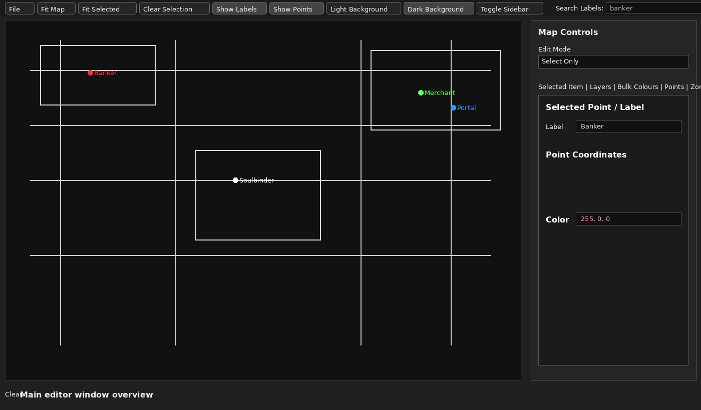

## Safety first

This tool edits EverQuest map `.txt` files. Before doing large edits or NPC cleanup work:

1. Make a copy of your entire EverQuest `maps` folder.
2. Prefer **File > Save As...** when testing edits.
3. Review **Pending Changes** before saving.
4. Keep automatically created backups until you have verified the edited maps in-game.

The editor stores support files beside the application:

```text
logs/
settings/
backups/
```

## Running the editor

### Running from source

Install dependencies:

```bash
pip install -r requirements.txt
```

Run:

```bash
python app/eq_map_editor.py
```

### Building locally on Windows

Install Python 3.11 or newer, then run:

```text
build_windows.bat
```

The build output appears in:

```text
dist/EQMapEditor/
```

The executable is:

```text
dist/EQMapEditor/EQMapEditor.exe
```

### Downloading from GitHub Actions

This repository includes a GitHub Actions workflow that builds a Windows portable `.exe` package.

1. Open the repository on GitHub.
2. Click **Actions**.
3. Click **Build Windows EXE**.
4. Click **Run workflow**.
5. Wait for the build to finish.
6. Download the artifact named **EQMapEditor-Windows**.
7. Extract `EQMapEditor-Windows.zip`.
8. Run `EQMapEditor.exe`.

## Main window overview

The main layout uses three working areas:

- **Explorer / navigation tools** for zones, layers, bulk tools, points, and pending changes.
- **Map canvas** for visual editing, panning, zooming, selecting, and previewing changes.
- **Inspector / sidebar tools** for selected item editing and NPC Match workflows.


The top row contains the inline **File** menu, view controls, label/point toggles, background toggles, search, and sidebar toggle.

The bottom canvas toolbar includes quick actions such as undo, redo, save edits, revert unsaved changes, zoom controls, and editing mode controls.

The application uses SVG toolbar icons for clear scaling at small toolbar sizes.

## Map file support

The editor works with standard EverQuest map text records.

### Lines

```text
L x1, y1, z1, x2, y2, z2, r, g, b
```

### Points

```text
P x, y, z, r, g, b, size, label
```

The editor can load one or more map files at once, such as:

```text
poknowledge.txt
poknowledge_1.txt
poknowledge_2.txt
poknowledge_3.txt
```

Each loaded file is treated as a layer/source file.

## File menu

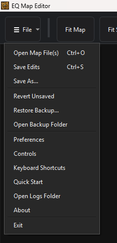

The **File** menu contains:

```text
Open Map File(s)
Save Edits
Save As...
Revert Unsaved
Restore Backup...
Open Backup Folder
Preferences
Quick Start
Keyboard Shortcuts
Open Logs Folder
About
Exit
```

### Open Map File(s)

Open one or more EQ map `.txt` files.

### Save Edits

Writes changes back to the loaded source files. Before overwriting, the editor writes timestamped backups to the local `backups/` folder.

The editor records file modified-times when files are loaded. If a target file changed externally after loading, the editor warns before overwriting.

### Save As...

Writes edited copies to a folder you choose without changing the original source files. This is the safest option for beta testing or batch cleanup review.

### Revert Unsaved

Reloads the current files from disk and discards unsaved edits.

### Restore Backup...

Restores a `.bak` file from the local backups folder.

### Open Backup Folder

Opens the local backup folder.

## Map display and navigation

The canvas displays:

- `L` records as coloured lines.
- `P` records as coloured points and labels.
- Multiple loaded map files as separate source layers.

Display options include:

- Show/hide labels.
- Show/hide points.
- Light or dark background.
- Optional display-Y flip in Preferences.
- Fit map.
- Fit selected records.
- Center selected records.
- Pan beyond the edge of the loaded map so map edges can be centered.
- Mini overview map showing the visible viewport.

## Editing tools

The editor supports visual editing of map points and lines:

- Select points and lines.
- Multi-select with drag selection and modifier selection.
- Edit point label, coordinates, colour, and size.
- Edit line endpoints and colour.
- Move points.
- Move whole lines.
- Move individual line endpoints.
- Add points.
- Add lines.
- Delete selected points/lines.
- Recolour multiple selected records at once.
- Undo and redo grouped edits.

The bottom canvas toolbar and Inspector edit mode controls stay synchronized.

## Global label search

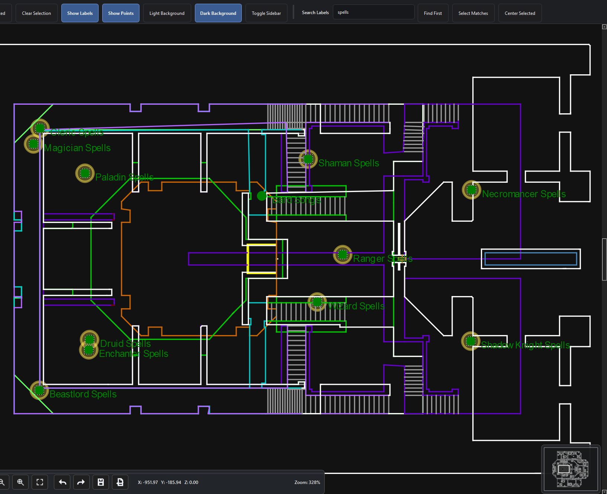

The toolbar search works on visible point labels.

### Find First

Selects the first visible point whose label contains the search text, centers on it, and shows its details.

### Select Matches

Selects and highlights all visible points whose labels contain the search text.

### Center Selected

Centers the view on the currently selected point/line records.

## Zones tab

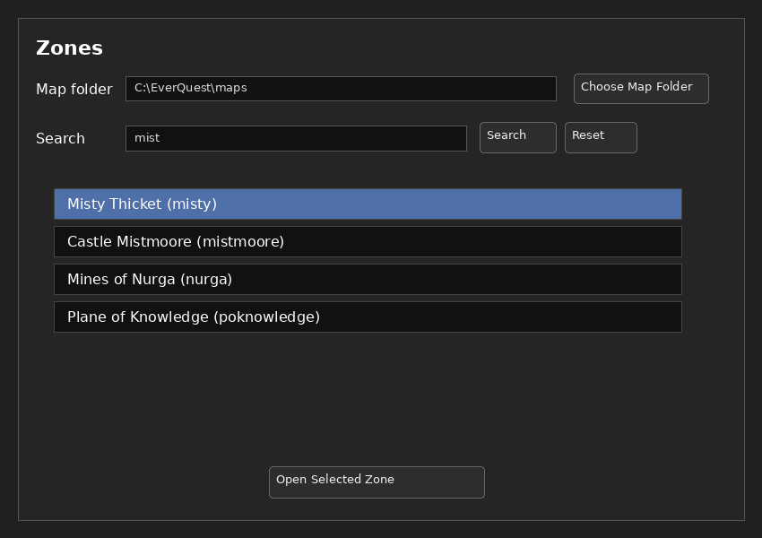

The **Zones** tab lets you choose an EQ map folder and open zones by full zone name or shortname.

It shows zones as:

```text
Full Zone Name (shortname)
```

Example:

```text
Misty Thicket (misty)
Plane of Knowledge (poknowledge)
Acrylia Caverns (acrylia)
The Bazaar (bazaar)
```

Double-click a zone or click **Open Selected Zone** to load its map files.

The editor looks for files such as:

```text
misty.txt
misty_1.txt
misty_2.txt
misty_3.txt
misty_4.txt
```

Zone search filters while typing.

## Layers tab

The **Layers** tools summarize loaded map files and let you control source-file visibility. This is useful when a zone uses multiple map text files such as the base map plus numbered overlay files.

Layer visibility affects what is shown, selected, searched, highlighted, and bulk-edited.

## Selected Item / Inspector tools

The Inspector shows details for the current selection.

For a point, you can edit:

- Label.
- X/Y/Z coordinates.
- RGB colour.
- Size.

For a line, you can edit:

- Endpoint coordinates.
- RGB colour.

For multi-selection, the Inspector shows a selection summary and supports grouped actions such as delete and recolour.

## Bulk colour tools

Bulk colour tools help identify and recolour groups of map records.

Features include:

- Separate colour lists for point colours and line colours.
- RGB swatches.
- Record counts per colour.
- Select/highlight all records using one or more colours.
- Recolour all prepared matching records.
- Palette conversion for light/dark map packs.

### Palette conversion

The palette conversion tools support built-in and custom palettes.

Built-in palettes include:

- EQ Map Standard.
- High Contrast.

Custom palettes are saved as JSON files in:

```text
app/palettes/
```

Palette conversion can map each visible colour to a palette role and then apply the matching light or dark RGB value.

The mapping preview groups visible colours separately by:

- Point colours.
- Line colours.

Each group can show:

- RGB swatch.
- RGB value.
- Count.
- Sample point labels when available.
- A dropdown to choose the palette role.

This avoids blindly converting colours when the same RGB value means different things in different maps.

## Points tools

The Points tools support point-focused review and bulk edits:

- Search point labels.
- Select all matching point labels.
- Bulk delete checked points.
- Bulk recolour checked points.
- Review point coordinates, labels, colour, and size.

## Pending Changes tab

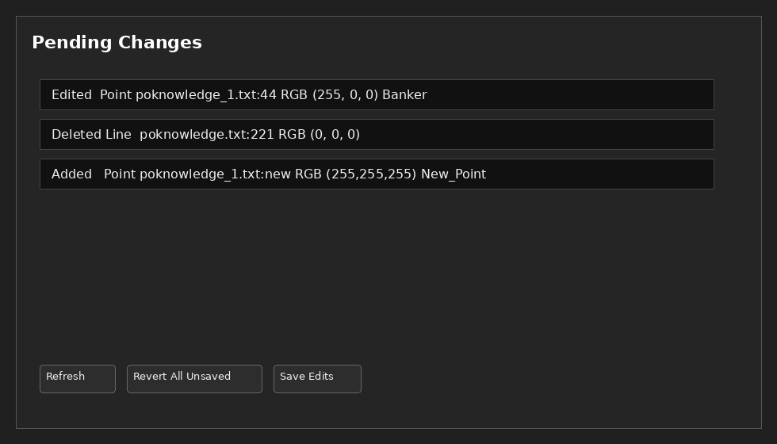

The **Pending Changes** tab lists unsaved edits so you can review changes before saving.

Buttons include:

```text
Refresh
Revert All Unsaved
Save Edits
```

## Preferences

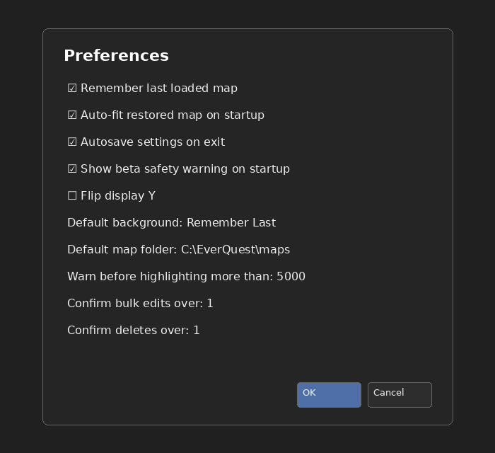

Open Preferences from:

```text
File > Preferences
```

Preferences include:

- Remember last loaded map.
- Auto-fit restored map on startup.
- Autosave settings on exit.
- Show beta safety warning on startup.
- Flip display Y.
- Default background.
- Default map folder.
- Warn before highlighting more than a selected number of records.
- Confirm bulk edits over a selected number of records.
- Confirm deletes over a selected number of records.

Settings are saved to:

```text
settings/eq_map_editor_settings.json
```

## NPC Match tools

The **NPC Match** tab compares the currently loaded zone against an NPC data source, usually `Combined Map Data.xlsx` or an exported CSV from the map/NPC extraction workflow.

The tools are designed around the same workflow used by the helper scripts:

- `extract_eq_map_points.py` builds the combined NPC/map data and assigns `Yes`, `Possible`, `Coordinate Match`, `NPC only`, and `Map only` statuses.
- `apply_combined_map_data.py` applies selected workbook actions back to map files while preserving point colour and size.

Inside the editor, the same ideas are applied interactively to the **currently loaded zone only**. This keeps the workflow fast and lets you preview changes before saving.

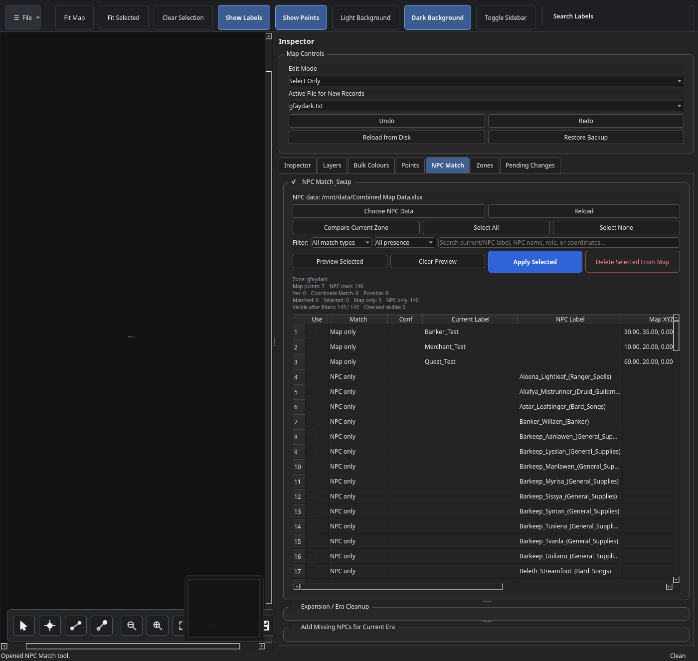

### NPC data source

Use **Choose NPC Data** to select an NPC data workbook or CSV. The expected data columns are the same columns produced by the combined data workflow, including:

```text
source_status
npc_matched
zone_shortname
npc_name
npc_role
npc_map_label
npc_map_x
npc_map_y
npc_map_z
min_expansion_number
min_expansion
max_expansion_number
max_expansion
map_label
map_x
map_y
map_z
map_source_file
match_distance
```

The app filters this data to the currently loaded zone shortname. For example, if `poknowledge.txt` is open, only rows where `zone_shortname` is `poknowledge` are considered.

### Matching rules

The editor follows the same match assignment pattern as `extract_eq_map_points.py`:

| Match status | Meaning |
|---|---|
| `Yes` | The NPC name is an exact normalized match to the map label or cleaned map label. |
| `Possible` | The NPC name is an alias/fuzzy match to the map label. This includes common role-prefix patterns and close spelling matches. |
| `Coordinate Match` | The row was already a possible name/alias/fuzzy match and the NPC/map distance is within 20 units. The app does not coordinate-match unrelated nearby labels. |
| `NPC only` | The NPC exists in the NPC data for this zone but does not appear to match a loaded map point. |
| `Map only` | The loaded map point does not appear to match an NPC row. |

Default checked rows are limited to `Yes` and `Coordinate Match`, matching the safer apply-script behavior.

### Generated NPC labels

NPC labels are generated as:

```text
npc_name_(npc_role)
```

Examples:

```text
Celent_Newmist_(Wizard_Spells)
Scholar_Awerrin_(Information)
Acomar_Lothwol
```

If `npc_role` is blank or `\N`, the label is just the NPC name. Spaces in roles are replaced with underscores.

## NPC Match tab layout

The NPC Match tab contains three collapsible workflow boxes:

1. **NPC Match & Swap**
2. **Expansion / Era Cleanup**
3. **Add Missing NPCs for Current Era**

Each box can be expanded or collapsed from its checkbox/header. A collapsed box shrinks to a single line. When one box collapses, the available height is redistributed to the open boxes: one open box gets all of the available height, and two open boxes split the available height.

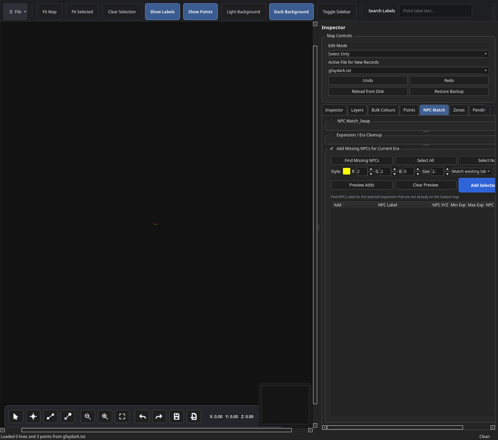

The whole NPC Match tab is scrollable, and each workflow table supports manually resizable columns. Drag a table header divider left or right to widen or shrink a column.

## Workflow 1: NPC Match & Swap

Use **NPC Match & Swap** when you want to replace existing map labels and coordinates with the matched NPC-data label and NPC map coordinates.

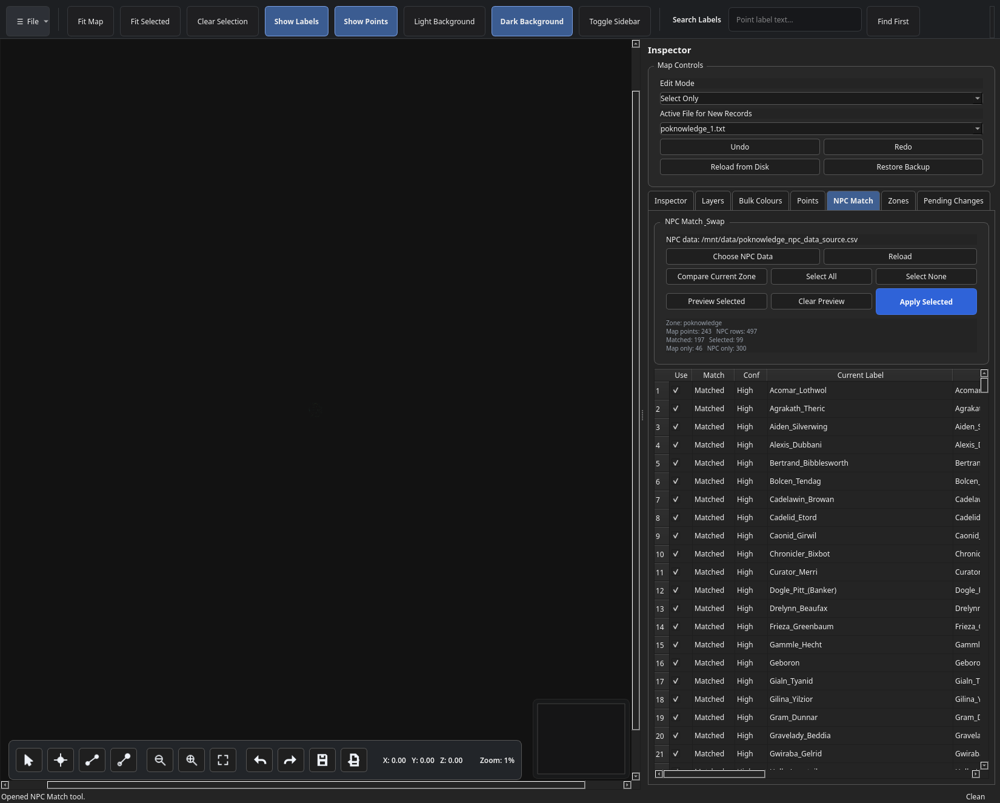

### Steps

1. Load a zone map.
2. Open **NPC Match**.
3. Click **Choose NPC Data** and select the combined NPC/map workbook or CSV.
4. Click **Compare Current Zone**.
5. Review the table.
6. Edit the **NPC Label** field if needed.
7. Use the filters/search tools to narrow the list.
8. Check the rows you want to update.
9. Click **Preview Selected**.
10. Click **Apply Selected** when the preview looks correct.
11. Click **Save Edits** to write the map file.

### Filters and search

The NPC Match & Swap section includes:

| Control | Purpose |
|---|---|
| Match Type | Shows all rows or only `Yes`, `Coordinate Match`, `Possible`, `NPC only`, or `Map only`. |
| Presence | Shows all rows, only rows already present on the map, or only rows missing from the map. |
| Search | Finds text across the current map label, NPC label, NPC name, NPC role, coordinates, and expansion text. |


### Table columns

Common columns include:

| Column | Meaning |
|---|---|
| Use | Whether the row is selected for preview/apply/delete. |
| Match Type | `Yes`, `Coordinate Match`, `Possible`, `NPC only`, or `Map only`. |
| Current Label | The label currently present in the loaded map. |
| NPC Label | The generated replacement label. This cell is editable. |
| Map XYZ | Current loaded map point coordinates. |
| NPC XYZ | NPC-derived replacement map coordinates. |
| Distance | Distance between map point and NPC spawn after coordinate conversion. |
| NPC Role | Role from the NPC data, if present. |

### Preview and apply

**Preview Selected** shows the proposed replacement labels/positions on the map without changing the file. **Apply Selected** updates the selected loaded map points in memory.

Applying a swap changes:

```text
label
x
y
z
```

It preserves:

```text
RGB colour
point size
source layer/file
```

The operation is undoable and the map is not written until **Save Edits** is clicked.

### Delete selected NPCs from map

Use **Delete Selected From Map** to remove selected rows that are already present on the loaded map. This is useful when the filters identify labels you do not want to keep.

Important behavior:

- `NPC only` rows are ignored because they are not currently on the map.
- The deletion is undoable.
- The map is marked dirty/unsaved.
- The map file is not changed until **Save Edits** is clicked.

## Workflow 2: Expansion / Era Cleanup

Use **Expansion / Era Cleanup** to find labels on the loaded map that do not belong in the selected expansion era.

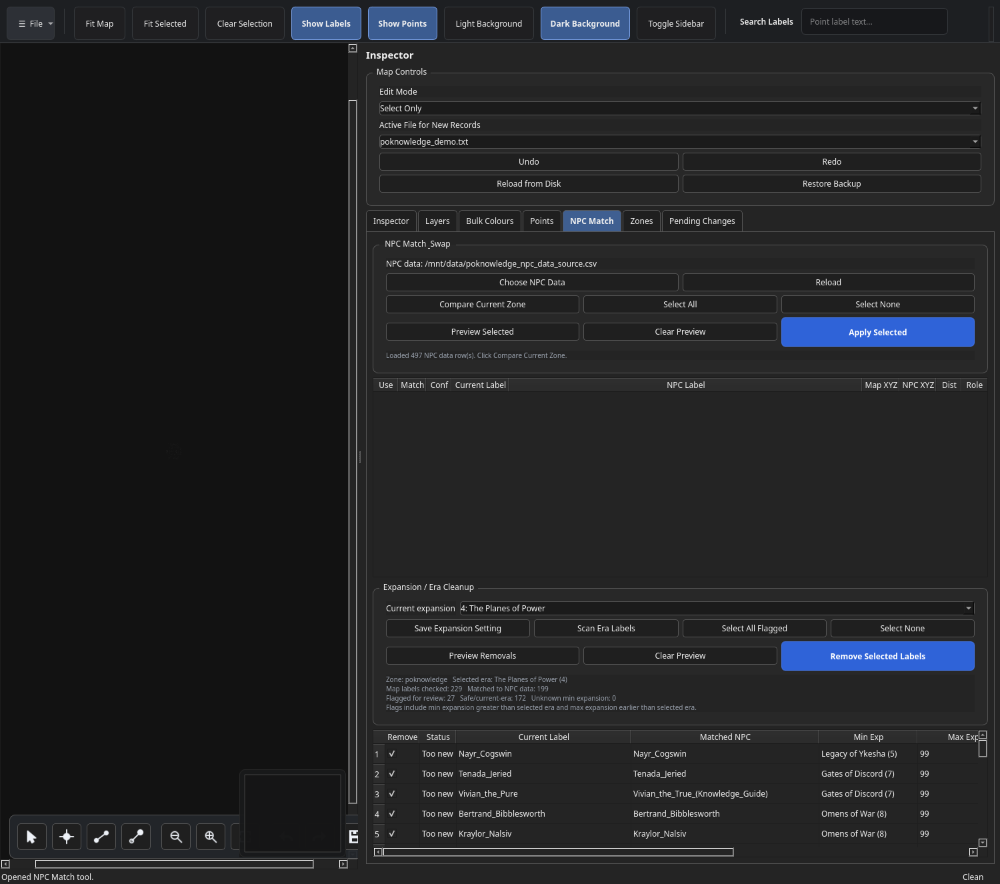

### Expansion setting

Choose your current expansion from the dropdown, then click **Save Expansion Setting** to store it in:

```text
app/settings/eq_map_editor_settings.json
```

The saved expansion is reloaded automatically when the editor starts and reused when changing maps.

### Era scan rules

A loaded map label is flagged when the matched NPC row has either:

```text
min_expansion_number > selected_expansion_number
```

or:

```text
max_expansion_number is known and max_expansion_number < selected_expansion_number
```

Blank, missing, or `-1` min/max values are treated as no known limit and are not automatically flagged.

### Steps

1. Load a map.
2. Choose NPC data if it has not already been loaded.
3. Select the current expansion.
4. Optionally click **Save Expansion Setting**.
5. Click **Scan Era Labels**.
6. Review the flagged labels.
7. Use **Preview Removals** to highlight them on the map.
8. Click **Remove Selected Labels** to remove the checked labels from the loaded map.
9. Click **Save Edits** when ready.

The removal is one undoable action and does not write to disk until the map is saved.

## Workflow 3: Add Missing NPCs for Current Era

Use **Add Missing NPCs for Current Era** when you want to add NPCs from the NPC data that fit the selected expansion and are not already present on the loaded map.

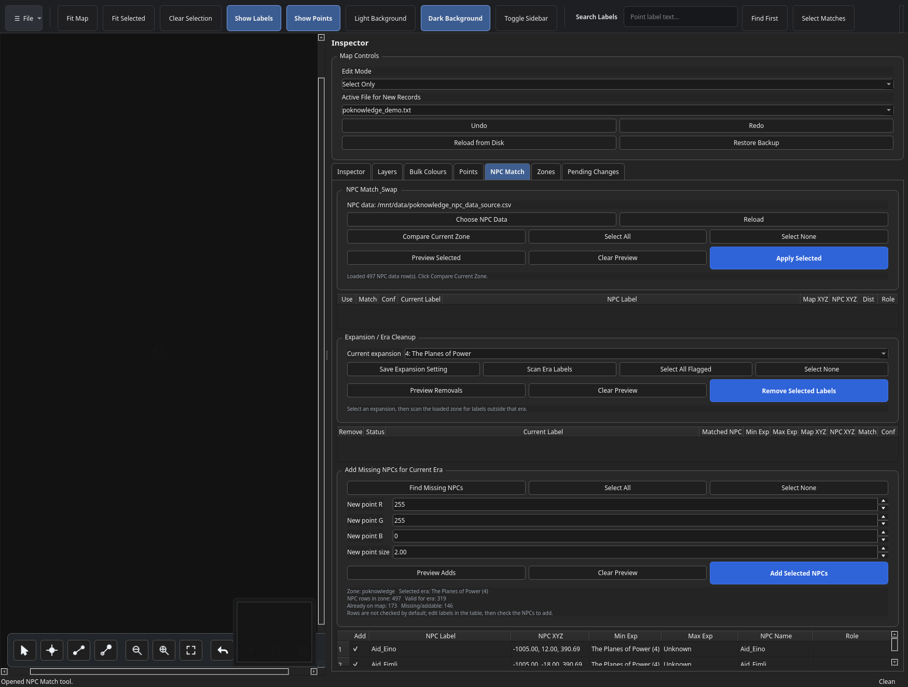

### What counts as addable

An NPC is shown in this workflow when:

- it belongs to the currently loaded zone;
- it fits the selected expansion using `min_expansion_number` and `max_expansion_number`; and
- the matching logic does not find it already present on the loaded map.

### Steps

1. Load a map.
2. Choose NPC data if needed.
3. Confirm the current expansion.
4. Click **Find Missing NPCs**.
5. Edit any **NPC Label** cells that need cleanup.
6. Check the NPCs you want to add.
7. Choose the RGB/size style for new labels.
8. Click **Preview Adds**.
9. Click **Add Selected NPCs**.
10. Click **Save Edits** when ready.

New NPCs are appended as new map `P` records using the NPC map XYZ coordinates, the editable table label, and the selected RGB/size values.

### RGB, size, and matching an existing label style

The Add Missing NPCs workflow has a compact style row:

```text
Style: [new colour preview] R [value] G [value] B [value] Size [value] [Match existing label style...] [source swatch] [Match]
```

Use this when you want added NPCs to match an existing label type, such as merchants, trainers, quest NPCs, or standard white labels.

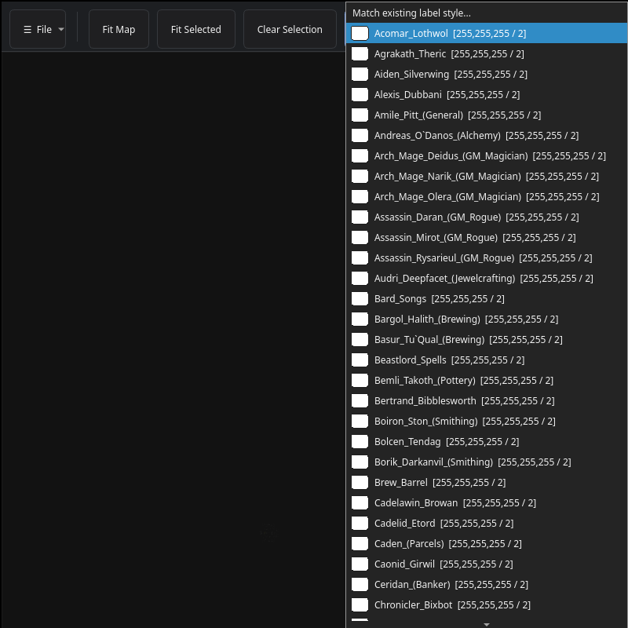

The dropdown contains the loaded map labels and shows a colour swatch for each label. Select a label and click **Match** to copy that label's:

```text
red
green
blue
size
```

The source swatch beside **Match** previews the currently selected existing label before copying.

## NPC Match safety notes

- All changes are preview-first where practical.
- Apply/add/remove operations change the loaded map in memory and mark it dirty.
- Nothing is written to the map file until **Save Edits** is clicked.
- Undo/Redo works for NPC Match changes as grouped actions.
- Keep backups of map folders before large cleanup operations.
- Review `Possible`, `Map only`, and era-cleanup rows before deleting or applying them.

## Keyboard shortcuts

```text
Ctrl+O   Open map files
Ctrl+S   Save edits
Ctrl+Z   Undo
Ctrl+Y   Redo
Ctrl+F   Focus label search box
Esc      Clear selection/highlights
Del      Delete selected records
Ctrl+A   Select all visible records
F        Fit map
```

## Known limitations

- This is beta software.
- Always keep backups of your map folder.
- Very large highlight operations can still take time if tens of thousands of records are highlighted.
- `Save As...` writes edited copies but does not switch the current editing session to the output folder.
- The zone full-name list is built in and may not include every custom/private server zone.
- NPC matching quality depends on the NPC data source and whether the current map labels are close enough to match.
- Review `Possible`, `Map only`, and era-cleanup rows before applying or deleting them.
- This release package builds a Windows executable using GitHub Actions or a local Windows Python environment.

## Repository structure

```text
app/
  eq_map_editor.py
  logs/
  settings/
  backups/
  resources/
  palettes/

docs/
  screenshots/

.github/
  workflows/
    build-windows.yml

build_windows.bat
build_windows.ps1
eq_map_editor.spec
requirements.txt
README.md
```

## License

Add your preferred license before publishing publicly.
